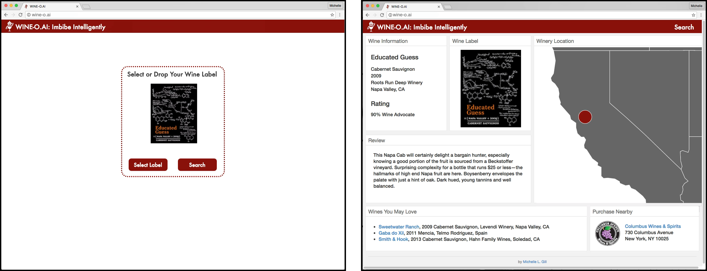

# WINE-O.AI: Computer Vision Assisted Wine Recommendations

by Michelle L. Gill, Ph.D.

----------------------------

This is the home of [WINE-O.AI](http://wine-o.ai), a computer vision-based wine label search and recommendation application. This project was completed for my passion project at [Metis](http://thisismetis.com) Summer 2016 Data Science Bootcamp. WINE-O.AI uses computer vision, natural language processing, collaborative filtering, and D3 for visualizaiton.

## Presentation

The project was presented on September 15, 2016 at Career Night. A [video](http://wineoai.michellelynngill.com/presentation/WINE-O_AI_MLGill.m4v) and [pdf](http://wineoai.michellelynngill.com/presentation/WINE-O_AI_MLGill.pdf) of the presentation slides is available.

## Application

The application is not yet live, but you can sign-up on the [website](http://wine-o.ai) to receive a notification of when the website launches.

